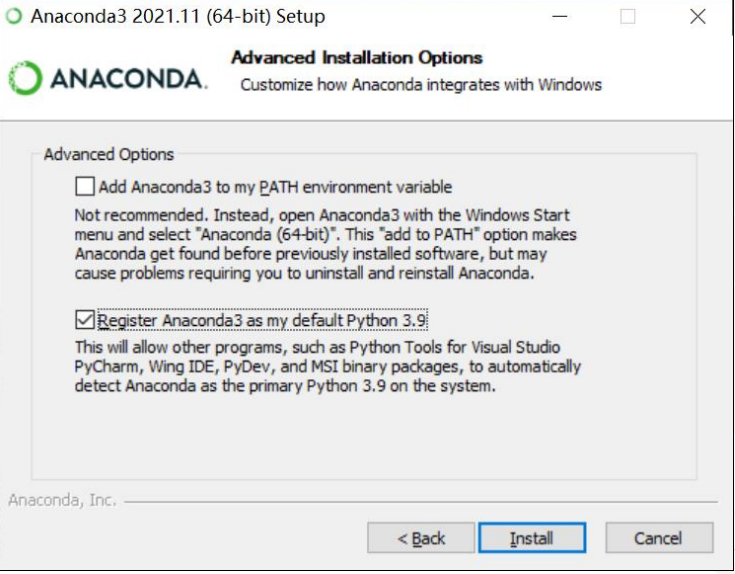
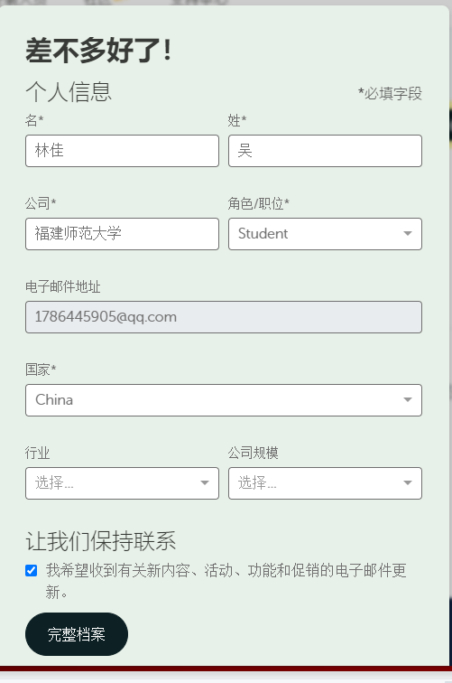
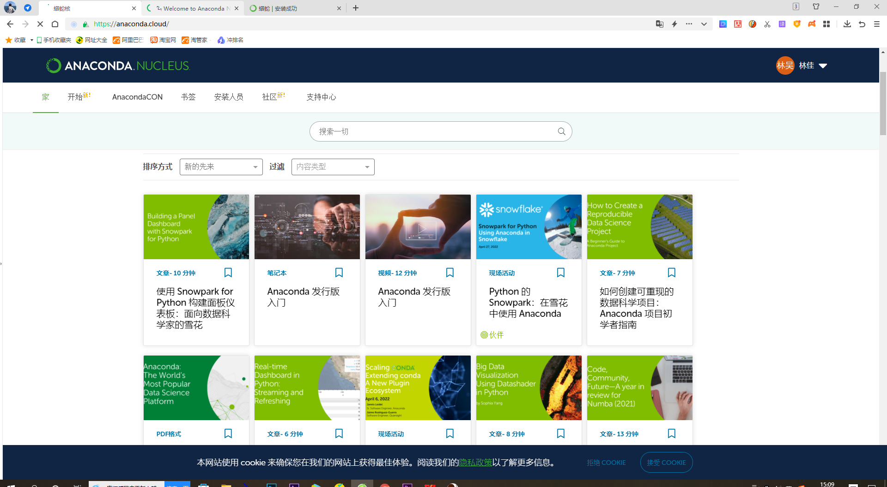
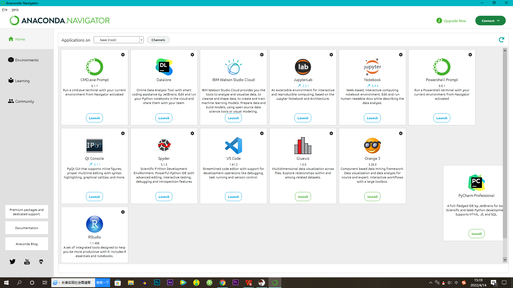
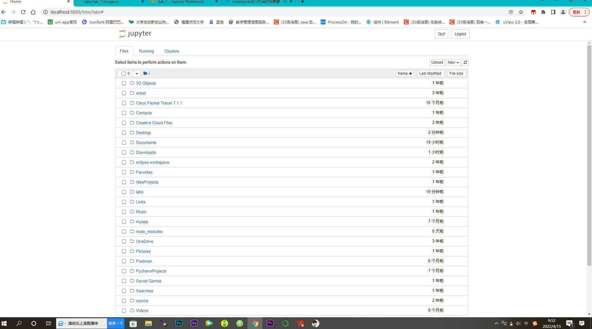
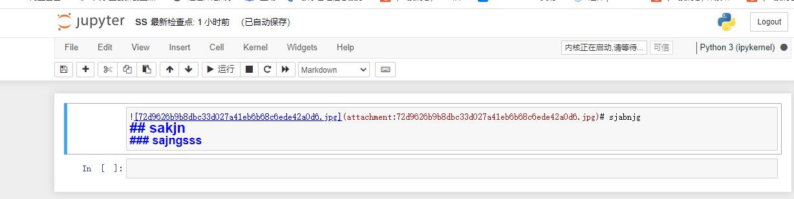

## 实验1_安装相关软件
### 第一步：安 装 Android Studio 4.1 之 上 的 版 本 ， 更 好 的 支 持
#### 由于这一步之前已经完成过，安装的android studio版本已经是4.1之上的，以下是安装好的截图
 
### 第二步：安装Anaconda
####  注意事项（1）在选择权限时候选择justme
#### 注意事项 （2）安装路径不能包括中文
#### 注意事项 （3） 选择register anaconda3 as my default python 3.9,如下图
 
#### 进行账号密码注册，截图如下：
 
#### 成功登录截图如下：
 
#### 安装成功标志：打开Anaconda Navigator导航栏，截图如下：
 
### 第三步： 运行notebook
#### 运行截图如下：
 
#### 新建一个md文档进行相关编写操作
 
#### 运行md文档
 


```python

```
