# 实验三
---
## 实现图像分类

### 步骤一-------下载示例代码
#### 打开网址登陆网站（https://github.com/hoitab/TFLClassify）下载代码

---

### 步骤二-------导入花卉图像模型（tensorflow lite model）
#### （1）右键“start”项目，点击“new/other/tensorflow lite model”
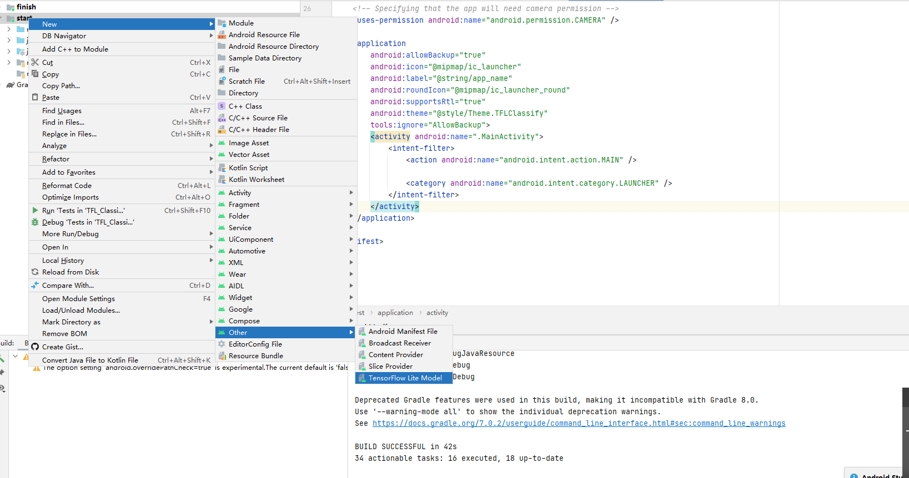 
#### （2）选择模型--- final文件下 ml/flowermodel.tflite文件
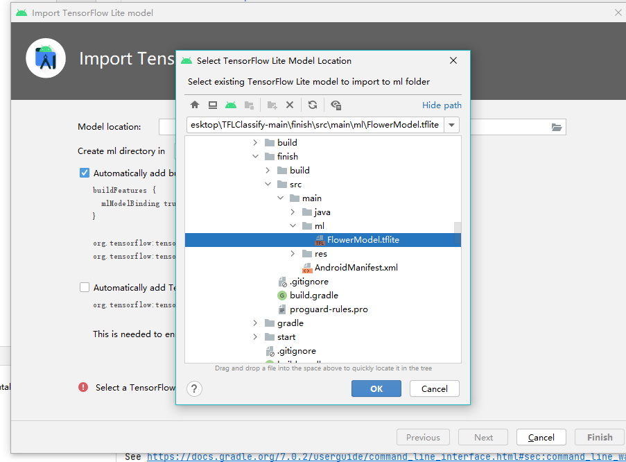 
#### （3）android studio自动导入gradle，直至看到“build successful”则表示导入完成，如下图：
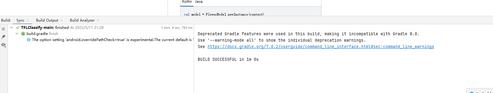 

---

### 步骤三-------开始补充代码
#### 此时start项目中的代码是不完整的，想要真正实现识别花卉图像功能，需要添加以下代码：
#### （1）在标注有todo5位置下添加如下图代码：
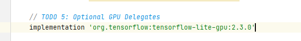 

#### （2）在标注有todo1位置下添加如下图代码：
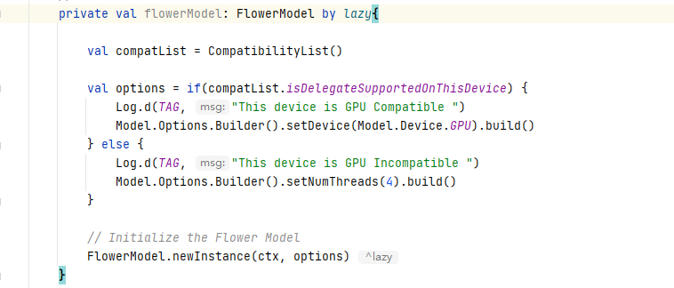 

#### （3）在标注有其他todo位置下添加如下图代码：
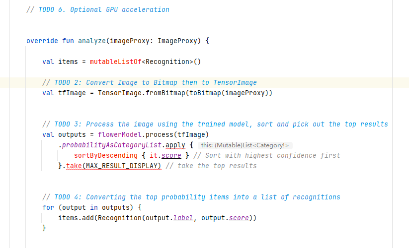 

---

### 步骤四-------真机运行（该识别程序只能运行在真机，在模拟器中功能无法完全展示）
#### （1）用数据线连接电脑和手机先将手机调至开发者模式后悔跳出usb调试如下图：
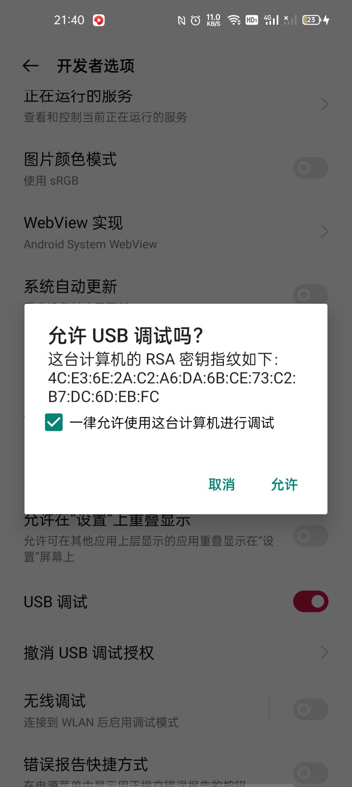 

#### （2）之后模拟器运行栏则跳出真机选项，此时start程序运行：
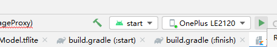 

---

### 程序可正常运行
#### 只需将运行后的框选位置对准花卉截图，下方栏目则会识别出花卉契合度最高的种类
#### （1）运行截图1：
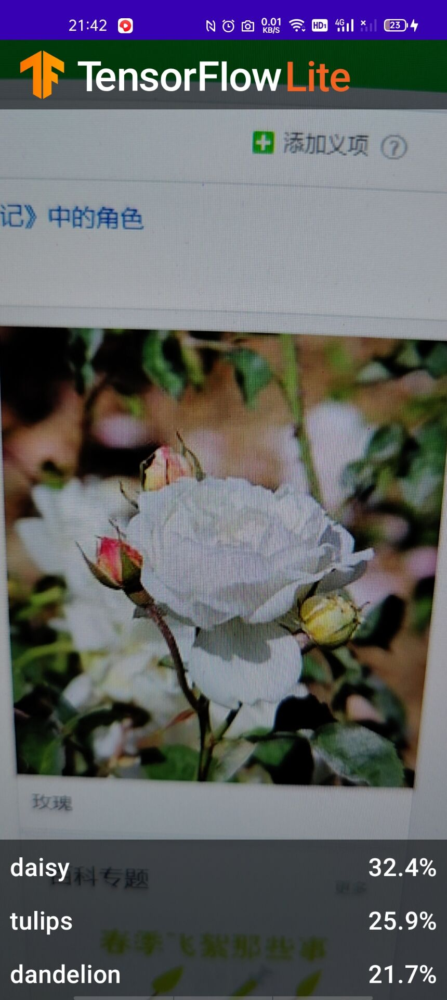 

#### （2）运行截图2：
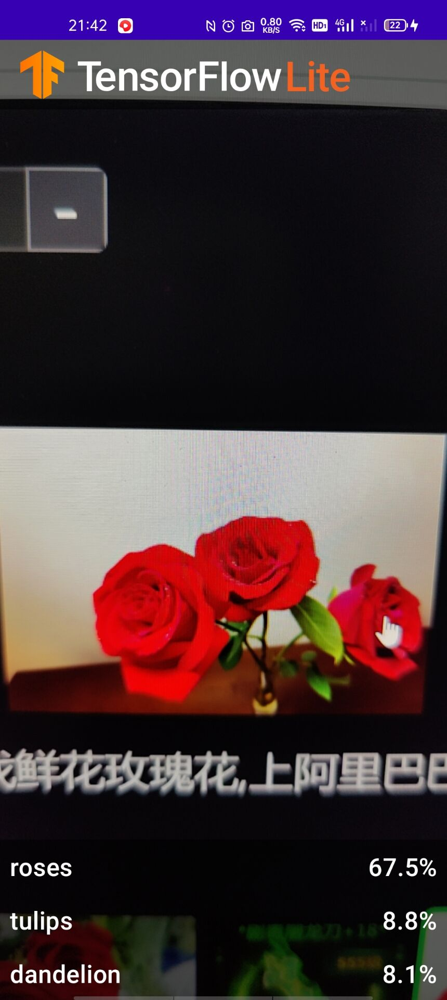 

#### （3）运行截图3：
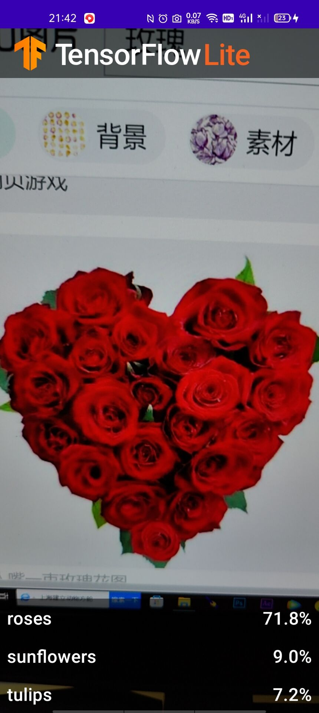 

